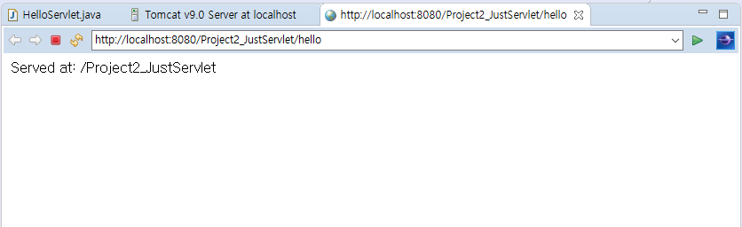

# 1강

## 1부 - 서블릿 생성해보기

1. 패키지 생성 (ex.sbstudy)
2. 서블릿 생성 (New > Servlet)
    1. Java package: `sb.study`
    2. Class name: `HelloServlet`
    3. Next 버튼 클릭
    4. URL mappings: `/HelloServlet` 클릭 -> Edit -> `/hello`
    5. Next 버튼 클릭
    6. Which method stubs would you like to create?
        - doGet, doPost가 선택되어 있음을 확인하고 Finish 버튼 클릭
3. 서버로 실행 후 `http://localhost:8080/.../hello` 접속 후 결과 확인
4. 아래와 같은 화면이 나오면 성공 
    - 
5. 이 때는 `@WebServlet` 어노테이션으로 `path`를 지정했으므로 `web.xml` 설정이 필요 없었음.
6. 실제로 `Servlet`이 특정한 `path`로 요청이 들어오는 경우 처리하게 하려면 어딘가엔 설정 내용이 있어야 한다.
    1. `XML`을 사용해서 정의하는 방법
    2. `@Annotation`을 사용해서 정의하는 방법

## 2부 - 서블릿 매핑하기

1. 새로운 서블릿 생성
2. 생성된 서블릿에서 `@WebServlet('/path')` 제거
3. `/WebContent/WEB-INF/web.xml` 파일을 열기
4. 아래와 같이 추가
    ```xml
    <!-- Servlet의 클래스와 그 클래스를 참조할 수 있도록 XML 내에서 사용될 이름을 정의한다. -->
    <servlet>
        <servlet-name>HelloServlet</servlet-name>
        <servlet-class>sb.study.HelloServlet</servlet-class>
    </servlet>

    <!-- Servlet의 이름과 URL 패턴을 정의한다. -->
    <servlet-mapping>
        <servlet-name>HelloServlet</servlet-name>
        <url-pattern>/hello</url-pattern>
    </servlet-mapping>
    ```
5. 오류 조심: `@WebServlet`과 `web.xml` 매핑을 같이 사용하면 Tomcat 시작 오류가 발생한다.

## 3부 - Servlet에 대한 설명

1. Servlet은 `javax.servlet.http.HttpServlet`을 상속한 클래스로 프로젝트 내에서 `web.xml` 이나 `@WebServlet`으로 특정 `path`로 매핑된 경우 서블릿 컨테이너(e.g Tomcat)에서 `path`로 요청이 들어온 경우 해당 서블릿을 실행한다. 즉 Servlet은 Java Web Project에서 요청을 처리하는 한 단위이다.
2. Servlet은 `HttpServletRequest`와 `HttpServletResponse` 객체를 전달 받게 되며, `HttpServletRequest`에 들어 있는 정보로 요청을 처리한 후 응답 결과를 반환하면 된다.
3. Servlet은 생명 주기 메소드: `init()` -> `service(req, res)` -> `destroy()` 순으로 호출된다. 이 때 `service()`는 요청 method를 확인해 `onXXX(req, res)` 를 호출하게 된다.
4. Servlet은 사용자의 요청이 올 때 마다 생성되며 한 번의 요청과 응답을 처리하는 단위가 된다. 이 때 Servlet은 각각 스레드 상에서 실행된다 :smile: 

## 4부 - HttpServletRequest와 HttpServletResponse 활용하기

1. Servlet이 Java Web Project에서 요청을 처리하는 한 단위라고 했었다.
2. 이번에 소개할 `Req, Res` 객체는 `Servlet`에 항상 주어지는 객체이다.
3. `Req` = 웹 요청 정보를 담고 있는 객체이고,
4. `Res` = 응답 시 활용할 수 있는 도구를 담은 객체이다.
5. `Req` 객체에서 자주 사용하는 메소드들을 설명하였다.
    ```java
    // 사용자가 갖고 있는 쿠키를 반환한다.
    request.getCookies();

    // View에 값을 전달할 때 사용한다.
    // View에선 이름으로 해당 Attribute에 접근하고, HTML을 출력하게 된다.
    request.setAttribute("attributeName", "attributeValue, it can be any Object");

    // 이름에 해당하는 attribute를 제거한다.
    request.removeAttribute("attributeName");

    // 이름으로 attribute를 가져온다.
    request.getAttribute("attributeName");

    // 요청에 담긴 헤더 중 매개변수와 동일한 이름을 가진 헤더의 값을 반환한다.
    request.getHeader("headerName");

    // GET의 경우 queryString에 담긴 값, POST의 경우 body에 담긴 값을 반환한다.
    // 이름으로 가져오게 된다.
    request.getParameter("parameterName");

    // QueryString 값을 가져온다.
    // 예: ?type=notice&page=1
    request.getQueryString();

    // 세션 객체를 반환한다.
    // 세션 객체는 세션이 만료되기 전까지 유지된다.
    // 세션 객체를 통해 주로 유저 정보를 저장한다.
    request.getSession();

    // ---------------------------------------------------

    // 쿠키를 추가한다.
    // 이름, 값 모두 String이어야 한다.
    response.addCookie(new Cookie("name", "value"));

    // 헤더를 추가한다.
    response.addHeader("headerName", "value");

    // URL로 리다이렉션 시킬 때 사용된다.
    response.sendRedirect("http://naver.com");

    // 응답 코드를 설정할 때 사용된다.
    response.setStatus(HttpServletResponse.SC_OK);

    // append, print, write 등의 메소드를 제공하는
    // PrintWriter 객체를 반환한다.
    // 텍스트 데이터 전용으로, 간단한 스크립트 혹은 값을 반환할 때 사용한다.
    response.getWriter();

    // getWriter를 사용하는 예시 1
    response.getWriter().append("Served at: ").append(request.getContextPath());
    /*
    * 예시 코드 2
        out = response1.getWriter();
        out.println("<Script language='JavaScript'>");
        out.println(" alert('" + message + "');");
        out.println("</Script>");
        out.flush();
        out.close(); 
    */

    // 응답을 작성하는 스트림을 반환한다.
    // 주로 파일 전송에서 사용된다.
    response.getOutputStream();
    /*
    * 예시 코드 - 파일을 클라이언트로 전송
        File file = new File("파일 경로");
        byte bytes[] = new byte[(int) file.length()];
        BufferedInputStream ins = new BufferedInputStream(new FileInputStream(file));
        BufferedOutputStream outs = new BufferedOutputStream(response.getOutputStream());

        int read = 0;
        if ((read = ins.read(bytes)) != -1) {
            outs.write(bytes, 0, read);
        }
        outs.flush();
        outs.close();
        ins.close();
    */
    ```