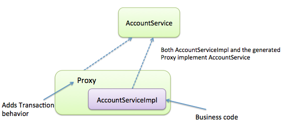

# Spring 기본기 - 목차

1. Spring이 무엇인가? - Shallow Ver
    - Framework란 무엇인가?
    - Framework를 염두에 두고 다시 Spring
    - Spring AOP
    - Spring Beans + Config(Java/XML)
    - Spring IoC/DI

2. 좋은 Java Code는 어떻게 작성해야 하는가?

3. 다시 객체지향 프로그래밍으로

4. 디자인 패턴

5. Spring이 무엇인가? - Deep Ver

6. Spring을 깊게 빠르게 배우는 방법에 대한 고찰

## Spring이 무엇인가? - Shallow Ver

1. Java 기반의 프레임워크로, 웹 개발에서 필연적으로 마주하게 되는 복잡한 구현 코드를 Spring에서 제공하는 쉽고 간단한 코드로 대체하게 하여 소스 코드의 전체적인 복잡성을 크게 줄여준다.

2. 스프링 프레임워크는 `Java Web 애플리케이션 프레임워크`이다. Spring의 핵심 기능들은 모든 Java 애플리케이션에서 사용 가능하지만, Spring의 다른 확장 기능은 Java EE 플랫폼에서 작동하는 웹 애플리케이션을 개발하는 데 사용할 수 있다. Spring Framework는 Java EE 프레임워크 기반의 개발 환경에서 모든 개발자가 각자 필요한 것들을 만들고 있음을 인식하고 개발자들이 재발명하지 않아도 되도록 등장했다. 즉 Spring Framework는 Java EE를 대체하려고 만들어졌다. 

3. 그러나 Spring Framework는 일반 Java 애플리케이션에서도 사용할 수 있는 기능(IoC/DI, PSA, AOP 등)이 핵심 기능이므로 완전히 Java EE에서만 사용될 수 있는 것은 아니다.

## Framework란 무엇인가?

1. Framework가 일반적인 사용자 생성 프로그램이나 라이브러리와 갖는 차이점은 프로그램의 제어 흐름을 갖고, 프레임워크를 사용하는 애플리케이션을 프레임워크가 호출하고 실행하게 되는 것이다. 애플리케이션의 시작점이나 객체의 Lifecycle을 Framework가 관리하기 때문에 Framework를 사용하게 되면 Framework에서 강제하는 코딩 방식이 강제된다.

2. Framework는 기본적으로 **1의 특징**을 갖지만, Framework를 사용하는 이유는 적은 학습/코딩 시간을 할당하여 최대한의 기능을 구현하는 것이 목표이므로, 역시 Library와 같이 일련의 API를 제공한다. Framework는 Library와 같이 일반적인 기능을 제공하며(주로 개발자들이 작성하게 되는 공통 코드이다.) 선택적으로 확장될 수 있다.
    - 왜 API를 제공하는 것이 적은 학습/코딩 시간을 할당하고, 최대한의 기능을 구현하는 것을 가능하게 하는걸까?
        - Library의 API로 제공되는 코드 누군가가 1회만 구현하면 다른 개발자(집단)은 이를 재사용 할 수 있는 **공통 코드**이다. 
        - 이러한 공통 코드의 `반환형/매개변수/구현에 대해 필수적으로 알아야 할 부분에 대한 설명`만 공부하더라도 내가 실제로 구현한 만큼의 생산성을 갖게 된다.
        - 보통 Library의 API로 제공되는 기능은 개인이 개발하기에 꽤 오래 걸리는 기능들이 대부분이다. 직접 작성하는 데 10분 안팎인 코드는 거의 Library가 없거나, 여러 타 기능과 함께 묶음(`bundle`)으로 제공된다.

3. 정리하자면, `프레임워크 = Library와 같이 API를 제공하는 라이브러리이자, 사용자의 App을 실행하는 실행 환경`이다.

## Framework를 염두에 두고 다시 Spring

1. Spring은 Framework이므로 IoC 컨테이너이다. 

2. Spring은 `Java EE Framework`를 대체하는 Framework로, `Servlet/JSP API`를 구현한 `Servlet Container`를 제외한 Java EE 기술에 의존하지 않는다. (단, Integration[통합]은 지원한다.)

3. Spring 핵심 기술 삼각형 - **PSA**, **IoC/DI**, **AOP**

## Spring AOP

1. Spring Framework의 기본 AOP 방식
    - AOP가 적용되는 객체를 대상으로 Proxy 객체를 생성함

    - Proxy가 무엇인가?
        1. Man in the Middle
        2. 의사소통의 중간에 위치하여, 두 객체 사이에서 상호작용을 대리함
        3. Proxy 개념을 프로그래밍으로 구현한 것이 `Proxy Pattern`이다.
    
    - Proxy Pattern의 구성
        1. Interface
        2. Implementation
        3. Proxy (Interface는 갖지만 실제 구현체에게 위임 + 추가 행위만 구현)
        4. 사용자는 Implementation 대신 Proxy 객체를 사용함

    - Proxy 객체 생성 라이브러리를 사용하는데, 총 3가지 방식이 있다.
        1. (JDK 1.3~) Dynamic Proxy     - 대상 객체가 Interface일 때
        2. CGLIB                        - 대상 객체가 Class일 때
        3. AspectJ                      - 외부 라이브러리이지만 완벽한 호환성 제공
        4. CGLIB은 ByteCode 수준에서 코드를 직접 변경하는 방식이고,
           AspectJ는 자체 컴파일러로 컴파일 시 코드를 직접 변경하는 방식이다.
           따라서 실제로 Proxy가 쓰이는 방식은 Dynamic Proxy 뿐이다.
        5. AspectJ와 같이 추가 설정 없이는 사용자가 JDK와 CGLIB의 차이를 알 필요가 없다.

    - Spring AOP의 내부적 구현 방식
        - 

        1. Proxy 객체를, 대상 객체(Target)를 전달받아 생성한다.
            - 이 때 Proxy 객체가 대상 객체를 직접 생성하는 것이 아니라
            - Spring Bean인 객체를 전달받게 된다.
            - 
        2. Method가 호출될 때 마다 MethodInterceptor가 invoke를 실행한다.
            - 이 Interceptor가 Advice 역할을 한다.
        3. 즉, Proxy 객체는 Target 객체와 동일한 인터페이스를 제공하고,
           메소드가 호출되는 경우 Target에게 위임도 하지만, 전/후로
           MethodInterceptor의 invoke도 실행하여 AOP를 구현하게 된다.

    - 어떻게 Proxy가 사용되는지 확인할 수 있는가?
        - 대상 객체를 `sysout`해보면 `transaction.TransactionProxyTest - $Proxy13` 와 같이 나오게 된다.
    
    - 언제 Proxy가 되는가?
        1. Proxy 클래스는 Spring Framework가 시작될 때(startup) 동적으로 생성된다.
            - 실제 파일로는 생성되지 않는다.
        2. Spring Framework는 AOP가 설정된 대상을 시작될 때(startup) 자동으로 scan한다.
            - `Spring Boot`를 쓰거나, 설정을 해야 한다. XML에서는 `<tx:annotaion-driven />` 으로 설정

    - 왜 동적으로 Proxy 객체를 만드는가?
        1. Proxy 객체를 직접 만들면 유지보수에 나쁘기 때문이다. 
            - Proxy로 부가 기능을 제공하지 않는 메소드는 단순 위임만 하게 되는데,
              이는 불필요한 복잡성을 일으켜 변경에 취약하게 된다. (OCP 위반)
            - 왜? 대상 객체가 수정될 때 마다 프록시 객체 또한 수정되어야 하기 때문

    - Proxy 방식이기 때문에 주의해야 하는 점
        1. `final` 메소드, 클래스의 경우 AOP를 사용할 수 없다. `@Override`가 불가능하기 때문에. CGLIB 방식의 AOP는 `동적으로 extends 한 클래스`로 AOP를 구현하는데, 이 방식이 불가능해진다.

    - 사용되는 주 예시
        1. Transaction - 트랜잭션 - commit, rollback 등을 수행하는 코드는 항상 중복됨
        
        2. Caching - 동일한 응답을 항상 계산해서 반환하기보다, 저장한 후 계산 없이 반환함
            - 컴퓨터 구조론의 Cache 참고
            - 계산 뿐만 아니라, Disk에서 읽어 응답할 것을 Memory 수준으로 옮기는 것도 Caching 이다.
            - `@Cacheable` 어노테이션 참고 - 메소드 단위로, 매개변수 값 마다 반환되는 값을 캐시할 수 있다.
        
        3. Authorization Check - 권한 정보를 읽어와 해당 행위를 실행할 권한이 있는지를 T/F로 반환
        
        4. Logging - 특정 행위를 실행했음을 서버에 저장함. Exception이 발생했거나 수집 대상 정보인 경우 수행
        
        5. Exception Handling - Exception을 처리하는 Handler로 Advice를 활용할 수 있음. try-catch보다 코드가 깔끔해지고 (indent 한 칸 빼는게 큼) 해당 Exception을 처리하는 코드를 한 곳에 집중시킬 수 있음

        6. 상속, 인터페이스 구현등의 방법이 없어도 횡단 관심사를 구현할 수 있음. Annotation으로 쉽게 Pointcut을 지정할 수도 있지만 XML로도 충분히 가능하며 따라서 POJO 방식의 개발을 지향할 때 AOP를 사용하게 됨. 

## Spring Beans

1. 